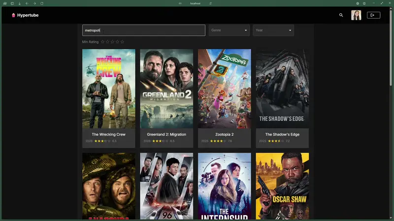
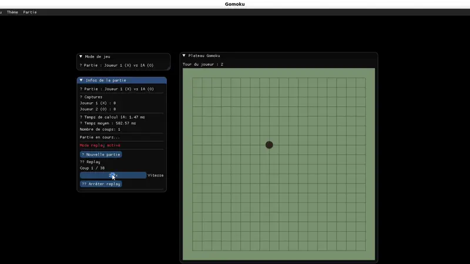

# Jee Park

### Software Developer • École 42 Paris Graduate

 

---

Recently graduated from École 42 Paris (January 2026) with an Expert degree in Computer Architecture (RNCP7), specialized in software development and database architecture. Developed backend data processing systems and REST API integrations on AWS serverless infrastructure during my work-study program at Oreve.

**Actively seeking my first full-time developer position** to launch my career in tech!

<table>
<tr>
<td width="50%" valign="top">

### Red Tetris

**Real-time multiplayer Tetris game**  
`React` `Redux` `Socket.io` `Node.js`

Collaborative Tetris where players compete in real-time. Complex state management with Redux, WebSocket synchronization, and responsive interface.

[View code →](https://github.com/jhparkkkk/red-tetris)

</td>
<td width="50%" valign="top">

### Hypertube

**Video Streaming Platform**  
`React` `Django` `PostgreSQL` `Torrent API`

Netflix-like streaming platform with torrent integration. Real-time video streaming, user authentication, and multi-language subtitles.

[View code →](https://github.com/jhparkkkk/hypertube)

</td>
</tr>

<tr>
<td width="50%" valign="top">

### Gomoku

**AI-powered strategy game**  
`Python` `Minimax` `Alpha-Beta Pruning`

Five-in-a-row game with AI opponent. Minimax algorithm with alpha-beta pruning, heuristic evaluation, and optimized game tree search.

[View code →](https://github.com/jhparkkkk/gomoku)

</td>
<td width="50%" valign="top">

### Fix-me

**Financial trading simulator**  
`Java` `Multi-Threading` `FIX Protocol`

Stock market simulator implementing FIX protocol. Multi-threaded broker and router architecture, order matching engine, and real-time market data processing.

[View code →](https://github.com/jhparkkkk/fix-me)

</td>
</tr>
</table>

---

               

---

